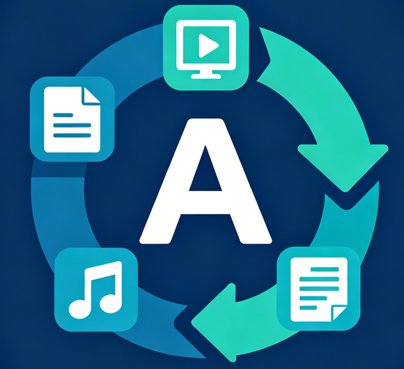

# 小A万能转换工具箱 2.0

> 一款完全本地运行的桌面文件格式转换工具，拖拽即用，隐私无忧。

  

---

## 这是什么？

**小A工具箱** 是一个 Windows 桌面软件，帮你轻松转换视频、音频、文档、图片和 PDF 的格式。不需要联网，不需要上传文件，所有处理都在你的电脑上完成。

## 能做什么？

### 🎬 视频处理
拖入视频文件，可以：
- **格式互转** — MP4 ↔ MKV ↔ AVI ↔ MOV ↔ WebM ↔ FLV
- **视频压缩** — 调整码率、分辨率、CRF 质量，给视频瘦身
- **视频裁剪** — 截取精彩片段
- **提取音频** — 从视频中提取 MP3/AAC/WAV 等
- **转 GIF** — 视频片段转动态表情包
- **视频截图** — 指定时间点提取画面

### 🎵 视频转音频（独立入口）
拖入多个视频，一键批量提取音频。支持 MP3 / AAC / WAV / FLAC / OGG / WMA，可调码率和采样率。

### 🎧 音频处理
- **格式互转** — MP3 / WAV / AAC / FLAC / OGG / WMA
- **多音频合并** — 拖拽多个音频按序拼接
- **音频裁剪** — 截取高潮部分

### 📄 文档转换
Word 转 PDF、Markdown 转 HTML、TXT 转 DOCX…… 支持 DOCX / PDF / MD / TXT / HTML / RTF / EPUB 互转。

### 🖼️ 图片转换
PNG ↔ JPG ↔ WebP ↔ BMP ↔ TIFF ↔ ICO，可调质量和尺寸。

### 📑 PDF 工具
- **合并** — 多份 PDF 按顺序合成一份
- **拆分** — 按页码范围拆成多个文件

### 📦 批量转换
拖入一堆不同类型的文件，统一转换成同一种格式，一键搞定。

---

## 为什么选它？

| 特点 | 说明 |
|------|------|
| 🔒 **完全本地** | 文件不离开你的电脑，无需联网 |
| 🖱️ **拖拽即用** | 拖文件进去，设格式，点按钮 |
| 📂 **多文件支持** | 所有页面都能同时处理多个文件 |
| 🎨 **深色/浅色主题** | 亮色、暗色、跟随系统，随时切换 |
| 📊 **文件信息预览** | 转换前查看分辨率、码率、时长 |
| 📐 **大小预估** | 转换前估算输出文件大小 |
| ⌨️ **快捷键** | `Ctrl+O` 选文件，`Ctrl+Enter` 开始，`Esc` 取消 |
| 📝 **转换历史** | 自动记录，方便回溯 |
| 🔔 **完成通知** | 转换完了弹窗告诉你 |

---

## 怎么用？

### 下载

从 [Releases](../../releases) 页面下载最新版 `xiao-a-toolbox-*-portable.zip`，解压后双击 `xiao-a-toolbox.exe` 运行。

> 精简版（~80MB）：音视频 + 图片处理  
> 完整版（~300MB）：包含文档转换（Pandoc 引擎）

### 使用步骤

1. 左侧选择功能模块
2. 拖拽文件到虚线框，或点击选择
3. 选择输出格式和参数
4. 点击「开始转换」
5. 等着，完成！

### 设置默认保存目录

在「设置」页设一个默认输出目录，之后转换就不用每次选保存位置了。

---

## 截图

> 运行 `npm run dev` 启动后截图放在 `screenshots/` 目录下

---

## 环境要求

- Windows 10 / 11 64 位
- 不需要安装任何运行环境，解压即用

---

## License

MIT — 自由使用、修改、分发。
